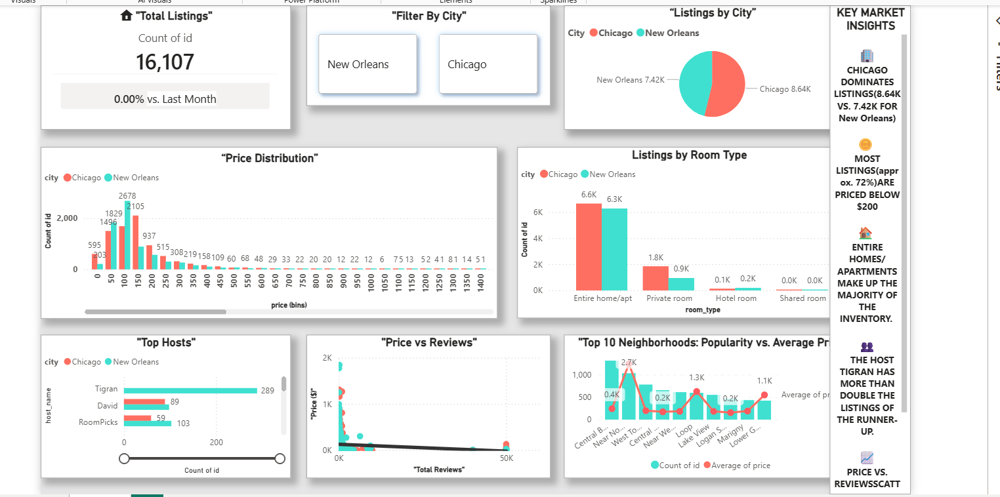

# Airbnb Data Analysis & Dashboard

Welcome to my **Airbnb Data Analysis & Dashboard** project! This project explores Airbnb listings data from multiple cities and visualizes key insights in a clean and interactive dashboard.

---

## 📊 Dashboard Preview

---

## 📝 Project Description

This project includes:

- Cleaning and preprocessing Airbnb datasets  
- Analyzing listings by **city, room type, and price bins**  
- Creating an interactive **Power BI dashboard** for insights  
- Visualizing **neighborhood popularity** and **average prices**  

---

## 🛠 Tools & Technologies

- **Power BI** – for dashboard creation  
- **Python (pandas, matplotlib, seaborn)** – for data cleaning & EDA  
- **CSV Files** – raw and cleaned data  
- **Jupyter Notebook** – analysis and visualization exploration  

---

## 📂 Folder Structure
Airbnb-Data-Analysis-Dashboard/
│── dashboard/
│ └── Airbnb_Dashboard.pbix
│── data/
│ └── airbnb_data.csv
│── cleaned data/
│ └── cleaned_airbnb.csv
│── notebooks/
│ └── analysis.ipynb
│── dashboard.png
│── README.md

---

## 🚀 How to Use

1. Open `Airbnb_Dashboard.pbix` in Power BI  
2. Explore interactive charts for:  
   - Total listings  
   - Listings by city  
   - Listings by room type  
   - Listings by price bins  
3. Use the insights to **understand Airbnb trends** in different cities  

---

## 💡 Insights

Some of the key insights from this dashboard:

- Most popular cities and neighborhoods for Airbnb listings  
- Distribution of room types across cities  
- Price trends and patterns for short-term rentals  

---

## 🔗 Repository Link

[GitHub Repository](https://github.com/Mah-creat/Airbnb-Data-Analysis-Dashboard)